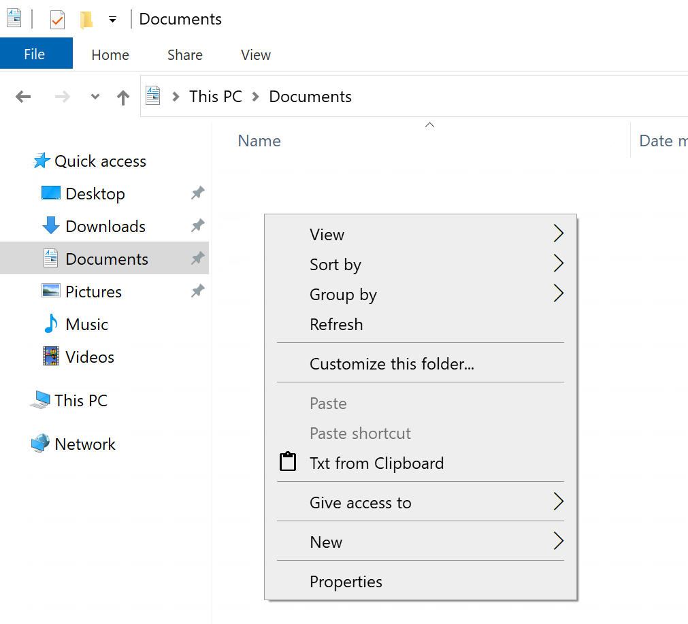

# Txt from Clipboard

## Table of contents
* [Installation](#installation)
    * [Build yourself](#build-yourself)
* [Usage](#usage)
* [Screenshots](screenshots)

This tool lets you create .txt files from your clipboard.

***

## Installation

### With an installer
1. Download the exe installer from the latest [release](https://github.com/IchbinLuka/TxtFromClipboard/releases/)
2. Execute the installer and follow the shown steps

### Build yourself
1. Run `compile.bat` to build the project
2. Compile `buildinstaller.iss` using InnoSetup to create an installer
    * This is neccessary to add the "Txt from Clipboard" context-menu option in the file explorer. Alternavely you can manually edit the Registry for this to work

## Usage
Right-click in any folder in the Windows-file-explorer and select "Txt from Clipboard". It is as simple as that.

## Screenshots

